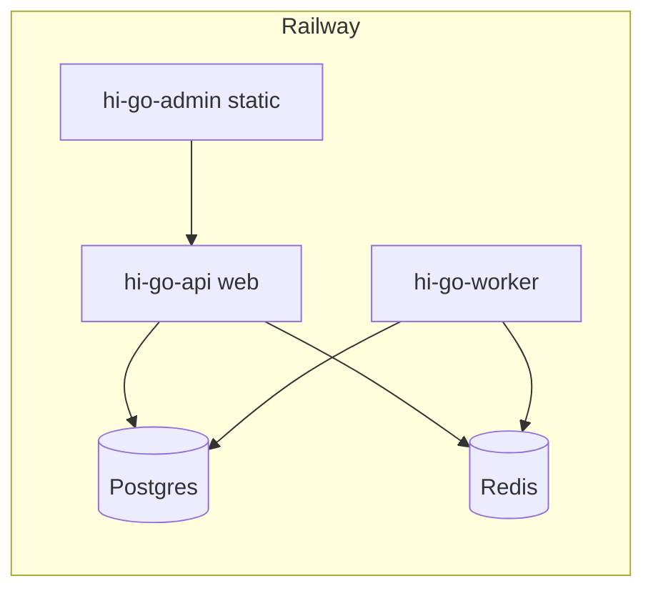

# HiGo — Local E2E Testing & Deployment Plan

**Date:** 26 June 2026  
**Scope:** Local full-stack test → Railway → Google Play → Apple App Store  
**Prerequisites:** [`HIGO_MASTER_ROADMAP.md`](./HIGO_MASTER_ROADMAP.md), [`HIGO_SCREEN_INVENTORY.csv`](./HIGO_SCREEN_INVENTORY.csv)

---

## 1. Platform completion status

| Layer | UI screens | Backend wired | Notes |
|-------|------------|---------------|-------|
| **Passenger app** | ~95% | ~90% | Chat, receipt, active trips, places, SOS wired |
| **Driver app** | ~92% | ~88% | Vehicle wizard, trip chat, earnings detail |
| **Admin dashboard** | ~95% | ~90% | Finance, promos, refunds, complaints |
| **API** | N/A | ~92% | Messages, promos, maps, push, worker |

**Intentionally deferred (MOU Phase 2):** Scheduled rides, driver wallet, app forced-update gate, fraud/security layer.

---

## 2. Local environment setup

### 2.1 One-time setup

```powershell
# From repo root (Windows)
cd C:\Users\flood\hiconnect\higo-platform

# Copy env
Copy-Item .env.example .env
# Edit .env: DATABASE_URL, REDIS_URL, JWT secrets, ENCRYPTION_KEY (44-char base64)

# Install
pnpm install

# Start infra
docker compose up -d

# Migrate + seed
cd apps\api
pnpm exec prisma migrate deploy
pnpm exec prisma db seed
cd ..\..
```

### 2.2 Dev OTP (read code from logs)

In `.env` for local testing:

```env
OTP_PROVIDER=termii
TERMII_API_KEY=
AFRICASTALKING_API_KEY=
```

With empty SMS keys, OTP is logged as `[DEVELOPMENT MOCK SMS]` in the API console.

Alternatively:

```bash
redis-cli GET "otp:+2348011111111"
```

### 2.3 Start all services (4 terminals)

| Terminal | Command | URL |
|----------|---------|-----|
| **1 — API** | `pnpm nx serve @higo/api` | http://localhost:3000 |
| **2 — Worker** | `pnpm nx build @higo/api` then `node apps/api/dist/worker.js` | — |
| **3 — Admin** | `pnpm nx serve @higo/admin-dashboard` | http://localhost:4200 |
| **4 — Passenger web** | `pnpm nx serve @higo/passenger-app` | http://localhost:4201 |
| **5 — Driver web** | `pnpm nx serve @higo/driver-app` | http://localhost:4202 |

Native apps (recommended for maps/push):

```bash
cd apps/passenger-app && pnpm exec expo start
cd apps/driver-app    && pnpm exec expo run:android   # or run:ios
```

### 2.4 Smoke checks (automated)

```bash
node scripts/smoke-api.cjs
pnpm nx e2e @higo/admin-dashboard-e2e   # needs API + admin dev servers
node scripts/local-e2e-ride.cjs         # set PASSENGER_OTP / DRIVER_OTP from logs
```

---

## 3. Manual end-to-end test script (full ride)

**Duration:** ~30 minutes  
**Devices:** 2 phones or 1 phone + 1 emulator (passenger + driver)

### Phase A — Infrastructure (5 min)

| Step | Action | Pass criteria |
|------|--------|---------------|
| A1 | `curl http://localhost:3000/health` | `{"status":"ok"}` |
| A2 | `curl http://localhost:3000/health/ready` | HTTP 200 |
| A3 | Worker process running | Log: `Bull dispatch worker started` |
| A4 | Admin login at :4200 | `admin@hiconnect.com` / `HiGo@Admin2024` |
| A5 | Dashboard KPIs load | No mock fallback banner |

### Phase B — Driver onboarding (10 min)

| Step | Action | Pass criteria |
|------|--------|---------------|
| B1 | Driver app → phone OTP login | JWT received |
| B2 | Complete KYC upload (or use approved seed driver) | Status `approved` |
| B3 | Vehicle onboarding wizard | Plate/model saved via `PUT /drivers/me` |
| B4 | Pay subscription (Paystack test) | `subscriptionExpiresAt` in future |
| B5 | Go online | `isOnline: true`, socket connected |

### Phase C — Passenger ride (10 min)

| Step | Action | Pass criteria |
|------|--------|---------------|
| C1 | Passenger OTP login | Home map shows nearby drivers (Abuja) |
| C2 | Booking → Places autocomplete | Pickup/dest resolved |
| C3 | Confirm ride + optional `WELCOME10` promo | Fare estimate returned |
| C4 | Finding driver | Socket `trip:matched` or timeout handled |
| C5 | Driver accepts on TripRequest | Passenger → DriverEnRoute |
| C6 | Trip chat | Message appears both sides (`trip:message_new`) |
| C7 | Driver navigates → I Have Arrived → Start → Complete | Status transitions |
| C8 | Passenger rates driver | `POST /trips/:id/rate-driver` |
| C9 | View receipt | TripReceipt screen shows fare breakdown |

### Phase D — Admin verification (5 min)

| Step | Action | Pass criteria |
|------|--------|---------------|
| D1 | Operations map | Live trip marker |
| D2 | Active trips page | Trip listed |
| D3 | Financial reports | Revenue reflects completed trip |
| D4 | Transaction logs | Payment audit row |

### Phase E — Trust & safety

| Step | Action | Pass criteria |
|------|--------|---------------|
| E1 | SOS contacts saved in passenger app | `GET /passengers/me/emergency-contacts` |
| E2 | SOS during trip | Uses real contacts (not mock) |
| E3 | Cancel during search | Cancellation fee modal shown |

---

## 4. Railway deployment plan

### 4.1 Architecture (3 services)



| Service | Source | Start command | Port |
|---------|--------|---------------|------|
| **hi-go-api** | `Dockerfile` | `node apps/api/dist/main.js` | 3000 |
| **hi-go-worker** | Same repo | `node apps/api/dist/worker.js` | — |
| **hi-go-admin** | `apps/admin-dashboard/dist` | Static or Vite preview | 80 |
| **Postgres** | Railway plugin | — | 5432 |
| **Redis** | Railway plugin | — | 6379 |

### 4.2 Deploy API (web)

1. Create Railway project → **New Service** → GitHub repo `higo-platform`
2. Set **Root directory** to repo root; builder: `Dockerfile`
3. Add **PostgreSQL** + **Redis** plugins; copy connection URLs
4. Set environment variables (see §4.4)
5. Deploy; verify `https://<api>.up.railway.app/health`
6. Run migrations (one-off command or deploy hook):

```bash
cd apps/api && pnpm exec prisma migrate deploy && pnpm exec prisma db seed
```

### 4.3 Deploy worker (second service)

1. **New Service** → same repo
2. **Start command:** `node apps/api/dist/worker.js`
3. **Same env vars** as API (especially `DATABASE_URL`, `REDIS_URL`)
4. No HTTP healthcheck required

### 4.4 Required Railway environment variables

```env
NODE_ENV=production
PORT=3000
APP_BASE_URL=https://api.higo.ng
APP_PAYMENT_CALLBACK_URL=https://api.higo.ng/api/payments/callback

DATABASE_URL=${{Postgres.DATABASE_URL}}
REDIS_URL=${{Redis.REDIS_URL}}

JWT_ACCESS_SECRET=<64-char-random>
JWT_REFRESH_SECRET=<64-char-random>
ENCRYPTION_KEY=<44-char-base64-aes-key>

OTP_PROVIDER=firebase
FIREBASE_SERVICE_ACCOUNT_JSON={"type":"service_account",...}
PUSH_ENABLED=true

GOOGLE_MAPS_API_KEY=<server-key>
MAPS_DIRECTIONS_ENABLED=true

PAYSTACK_SECRET_KEY=sk_live_xxx
PAYSTACK_PUBLIC_KEY=pk_live_xxx
PAYSTACK_PLAN_DAILY=PLN_xxx
PAYSTACK_PLAN_WEEKLY=PLN_xxx
PAYSTACK_PLAN_MONTHLY=PLN_xxx

CLOUDFLARE_ACCESS_KEY_ID=...
CLOUDFLARE_SECRET_ACCESS_KEY=...
CLOUDFLARE_ACCOUNT_ID=...
CLOUDFLARE_R2_BUCKET=higo-kyc-docs

SENTRY_DSN=https://...@sentry.io/...
SURGE_ENABLED=false
```

### 4.5 Deploy admin dashboard

**Option A — Railway static service**

```bash
pnpm nx build @higo/admin-dashboard
# Deploy dist/ with VITE_API_URL=https://api.higo.ng
```

**Option B — Cloudflare Pages / Vercel**

- Build: `pnpm nx build @higo/admin-dashboard`
- Env: `VITE_API_URL=https://api.higo.ng`

### 4.6 Post-deploy smoke

```bash
BASE=https://api.higo.ng node scripts/smoke-api.cjs
```

### 4.7 Mobile app env (production)

```env
EXPO_PUBLIC_API_BASE_URL=https://api.higo.ng
EXPO_PUBLIC_SOCKET_URL=https://api.higo.ng
EXPO_PUBLIC_GOOGLE_MAPS_API_KEY=<android/ios-restricted>
EXPO_PUBLIC_PAYSTACK_PUBLIC_KEY=pk_live_xxx
EXPO_PUBLIC_SENTRY_DSN=https://...
EXPO_PUBLIC_MAPS_MOCK=false
EXPO_PUBLIC_PUSH_MOCK=false
```

---

## 5. Google Play Store deployment

### 5.1 Prerequisites

| Item | Detail |
|------|--------|
| Google Play Console | $25 one-time, organization account |
| Package name | `com.higopassenger` / `com.driverapp` (update in `app.json`) |
| Signing | EAS manages keystore or upload key |
| Privacy policy URL | Required |
| Data safety form | Location, phone, payment data |

### 5.2 Build production AAB

```bash
# Passenger
cd apps/passenger-app
eas build --platform android --profile production

# Driver
cd apps/driver-app
eas build --platform android --profile production
```

Update `eas.json` production profile:

```json
{
  "production": {
    "autoIncrement": true,
    "android": { "buildType": "app-bundle" },
    "env": {
      "EXPO_PUBLIC_API_BASE_URL": "https://api.higo.ng",
      "EXPO_PUBLIC_SOCKET_URL": "https://api.higo.ng"
    }
  }
}
```

### 5.3 Google Maps Android key

1. Google Cloud Console → APIs: Maps SDK Android, Directions API
2. Create key restricted to package `com.higopassenger` + SHA-1 from EAS credentials
3. Add to `app.json` → `android.config.googleMaps.apiKey` or env

### 5.4 Play Console checklist

- [ ] Internal testing track → 20 testers
- [ ] Closed testing → Abuja pilot group
- [ ] Store listing: screenshots (6.7" + 10"), feature graphic, description
- [ ] Content rating questionnaire
- [ ] Target API level 34+
- [ ] Background location declaration (driver app)
- [ ] Promote to production

---

## 6. Apple App Store deployment

### 6.1 Prerequisites

| Item | Detail |
|------|--------|
| Apple Developer Program | $99/year |
| Bundle IDs | `com.higopassenger`, `com.driverapp` |
| App Store Connect | Two app records |
| Privacy Nutrition Labels | Location, contacts, financial data |

### 6.2 Build production IPA

```bash
cd apps/passenger-app
eas build --platform ios --profile production
eas submit --platform ios

cd apps/driver-app
eas build --platform ios --profile production
eas submit --platform ios
```

### 6.3 iOS-specific config

In `app.json` / `eas.json`:

- `ios.bundleIdentifier`
- `ios.infoPlist.NSLocationWhenInUseUsageDescription`
- `ios.infoPlist.NSLocationAlwaysAndWhenInUseUsageDescription` (driver)
- Push: upload APNs key to Firebase / Expo

### 6.4 App Store checklist

- [ ] TestFlight internal → 90 day beta
- [ ] TestFlight external → Abuja pilot
- [ ] App Review notes: test account phone + OTP instructions
- [ ] Export compliance (standard encryption)
- [ ] Submit for review

---

## 7. Deployment timeline (recommended)

| Week | Milestone |
|------|-----------|
| **W1** | Local E2E green (manual ride script §3) |
| **W2** | Railway staging: API + worker + admin; smoke scripts pass |
| **W3** | Drop production secrets; staging ride with real Paystack test |
| **W4** | EAS internal builds → TestFlight + Play internal testing |
| **W5** | Abuja pilot (50 drivers, 200 passengers) |
| **W6** | Store submission + production Railway scale (2 API replicas) |

---

## 8. Credentials checklist (you must provide)

| Secret | Used for |
|--------|----------|
| `FIREBASE_SERVICE_ACCOUNT_JSON` | OTP + push |
| `GOOGLE_MAPS_API_KEY` (3 keys: server, Android, iOS) | Maps + directions |
| `PAYSTACK_*` live keys | Payments |
| `CLOUDFLARE_R2_*` | KYC document storage |
| `SENTRY_DSN` | Error tracking |
| Apple APNs `.p8` key | iOS push |
| Play Console + App Store accounts | Store listing |

---

## 9. Rollback & monitoring

| Signal | Action |
|--------|--------|
| `/health/ready` fails | Railway auto-restart; check Postgres/Redis |
| Sentry error spike | Roll back API deploy via Railway |
| Dispatch timeouts | Verify worker service running |
| Socket disconnects | Confirm `REDIS_URL` shared across API replicas |

---

## 10. Quick reference commands

```bash
# Full local stack
docker compose up -d
pnpm nx serve @higo/api
node apps/api/dist/worker.js
pnpm nx serve @higo/admin-dashboard

# Verify
node scripts/smoke-api.cjs
pnpm nx test @higo/api
pnpm nx build @higo/api @higo/passenger-app @higo/driver-app @higo/admin-dashboard

# Migrations on deploy
cd apps/api && pnpm exec prisma migrate deploy

# Store builds
eas build --platform all --profile production
```

---

*Update this document when Railway URLs and bundle IDs are finalized.*