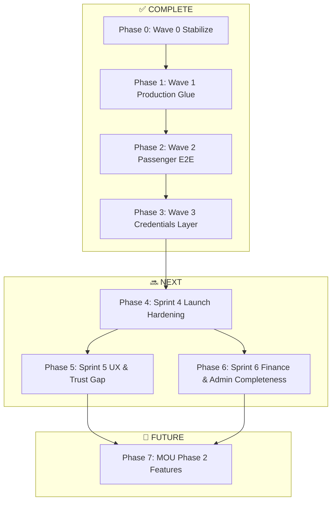

# HiGo Platform — Master Roadmap & Multi-Agent Execution Plan

**Date:** 25 June 2026  
**Scope:** `higo-platform/` monorepo (Passenger, Driver, Admin) vs MOU / Kickoff screen library  
**Companion:** [`HIGO_SCREEN_INVENTORY.csv`](./HIGO_SCREEN_INVENTORY.csv) — 86 screen rows with file paths, wire status, sprint assignment  
**Supersedes:** Informal gap summaries; complements [`PARALLEL_AGENT_ACTIVATION_PLAN.md`](./PARALLEL_AGENT_ACTIVATION_PLAN.md) with screen-level truth

---

## 1. Executive snapshot

| Dimension | Score | Meaning |
|-----------|-------|---------|
| **Screen UI exists** | **78%** (67/86 rows) | Most MOU screens exist or are merged into another screen |
| **Wired to production API** | **62%** | Core ride loop + admin ops work end-to-end |
| **Launch-ready quality** | **55%** | Remaining gap = missing screens + thin/mock features |
| **Infrastructure (Waves 0–3)** | **~90% code-complete** | Worker, Redis adapter, pricing, push/maps/Sentry stubs ready |

### Four engines (MOU framing)

| Engine | Status | Blocker |
|--------|--------|---------|
| **Matching** | 🟢 ~85% | Staging ride test + multi-instance QA |
| **Payments** | 🟡 ~65% | Wallet stub, refund admin, live Paystack keys |
| **Operations** | 🟢 ~78% | Transaction log + refund UI |
| **Trust** | 🟡 ~60% | Chat backend, SOS real contacts, ratings drill-down |

---

## 2. Phase map (all waves)



| Phase | Name | Duration | Parallel agents | Status |
|-------|------|----------|-----------------|--------|
| **0** | Stabilize | 4h | 1 (Orchestrator-0) | ✅ Done |
| **1** | Production glue | 1 week | 4 | ✅ Done |
| **2** | Passenger + socket E2E | 1 week | 3 | ✅ Done |
| **3** | Push / Maps / Sentry | 3–5 days | 3 | ✅ Done (needs secrets to go live) |
| **4** | Launch hardening | 1 week | 2 | ✅ Done |
| **5** | UX & trust gaps | 1 week | 4 | ✅ Done |
| **6** | Finance & admin completeness | 1 week | 4 | ✅ Done |
| **7** | MOU Phase 2 | 2+ weeks | TBD | 📅 Backlog |

---

## 3. Completed work log (Phases 0–6)

### Phase 4 — Sprint 4 ✅
| Agent | Deliverable |
|-------|-------------|
| S4-QA | Playwright `admin.spec.ts`, `scripts/smoke-api.cjs`, e2e project.json |
| S4-G | PromoCode model, `/admin/promos` CRUD, `WELCOME10` seed, Promotions page |

### Phase 5 — Sprint 5 ✅
| Agent | Deliverable |
|-------|-------------|
| S5-A | Location + Notification permission screens (both apps) |
| S5-B | Google Places autocomplete, `/drivers/nearby`, map markers |
| S5-C | SOS emergency contacts API-wired, TripActive mock removed |
| S5-D | Vehicle onboarding wizard after KYC |

### Phase 6 — Sprint 6 ✅
| Agent | Deliverable |
|-------|-------------|
| S6-A | Paystack card-save test flow, Wallet trip payment history |
| S6-B | Saved places, Settings hub, CancellationFeeModal, OfflineScreen |
| S6-C | Trip earnings detail, ratings screen, offline queue UI, training content |
| S6-D | Transaction logs, refunds, complaints inbox, active trips admin pages |

---

## 3b. Earlier phases (0–3)

### Phase 0 — Stabilize ✅
- Fixed `admin.controller` Prisma bugs
- API build + 29 tests green
- Railway smoke curls in `apps/api/README.md`

### Phase 1 — Production glue ✅
| Agent | Deliverable |
|-------|-------------|
| 2-Infra | `worker.ts`, Procfile, Redis socket adapter |
| 2-Pricing | DB pricing + surge flag + unit tests |
| 7-Wiring | PlatformSettings, admin live data, mock removal |
| 6-Maps-Socket | Driver socket centralization, Navigation map |

### Phase 2 — Passenger E2E ✅
| Agent | Deliverable |
|-------|-------------|
| 5-Wiring | Booking → rate flow, socket lifecycle, trip history |
| 5-Chat | — (deferred; ChatSupport still mock) |
| 2-Chat | — (deferred; no Message model yet) |

### Phase 3 — Credentials layer ✅
| Agent | Deliverable | Needs secret |
|-------|-------------|--------------|
| Push | `PushService`, expo-notifications both apps | `FIREBASE_SERVICE_ACCOUNT_JSON`, `PUSH_ENABLED=true` |
| Maps | `GET /api/maps/directions`, route polylines | `GOOGLE_MAPS_API_KEY` |
| Obs | Sentry API + RN SDK | `SENTRY_DSN`, `EXPO_PUBLIC_SENTRY_DSN` |

---

## 4. Screen gap summary (from inventory)

| Status | Count | % |
|--------|-------|---|
| EXISTS + WIRED | 42 | 49% |
| EXISTS + PARTIAL/MOCK/UI_ONLY | 25 | 29% |
| MISSING | 14 | 16% |
| BY_DESIGN (separate apps) | 1 | 1% |
| Bonus (not in MOU) | 1 | 1% |
| **Total rows** | **86** | |

### Missing screens (build from scratch)

| ID | Screen | Sprint |
|----|--------|--------|
| PAX-17 | Scheduled ride | P7 |
| PAX-19 | Cancellation fee | S6-B |
| PAX-25 | Saved places | S6-B |
| DRV-13 | Trip earnings detail | S6-C |
| DRV-15 | Driver wallet | P7 |
| DRV-22 | Ratings & performance | S6-C |
| ADM-19 | Refund management | S6-D |
| ADM-20 | Support tickets | S6-D |
| SYS-03 | App update | P7 |
| SYS-06 | Security verification | P7 |

### Highest-impact partials (wire existing UI)

| ID | Screen | Gap | Sprint |
|----|--------|-----|--------|
| PAX-22 | Support chat | No Message backend | S4-C |
| PAX-20/21 | SOS | Mock contacts on trip | S5-C |
| PAX-01 | Home map | No nearby drivers | S5-B |
| PAX-02/03 | Booking | No Google Places | S5-B |
| PAX-11/27 | Payments/wallet | Paystack/wallet stub | S6-A |
| DRV-01/21 | Driver onboarding | No vehicle wizard | S5-D |
| ADM-12/19 | Finance | No txn log / refund UI | S6-D |

---

## 5. Sprint plan (Phases 4–6) — parallel super-agent activation

### Design rules (all sprints)

1. **Disjoint file ownership** per agent — see conflict matrix §7  
2. **Freeze `packages/shared-types`** during any sprint touching socket/message types  
3. **Branch pattern:** `sprint-N/agent-<id>-<slug>`  
4. **Gate:** `pnpm nx build` all touched projects + `pnpm nx test @higo/api`  
5. **Activate:** paste agent prompt blocks below into parallel Task/subagent runs

---

### Sprint 4 — Launch hardening (Phase 4) · ~1 week · 2 agents parallel

**Goal:** Confidence to ship staging without manual babysitting.

| Agent | ID | Owns | Hours |
|-------|-----|------|-------|
| **Agent-QA** | S4-QA | `apps/api-e2e/`, `apps/admin-dashboard-e2e/`, `scripts/test-browser.cjs`, CI config | 16h |
| **Agent-Growth** | S4-G | `apps/api/prisma/` (promo schema), `apps/api/src/promos/`, admin promo CRUD | 10h |

#### S4-QA prompt
```
Read HIGO_MASTER_ROADMAP.md Sprint 4. Create Playwright e2e for admin-dashboard:
login → dashboard KPIs → driver list. Add API smoke script extensions.
Seed fixtures in apps/api/prisma/seed.js if needed.
Do NOT touch passenger-app or driver-app native builds.
Verify: pnpm nx e2e @higo/admin-dashboard-e2e (or create target).
```

#### S4-G prompt
```
Read HIGO_MASTER_ROADMAP.md Sprint 4. Add PromoCode model + migration,
POST /trips/request promo hook, admin promo CRUD page.
Own: apps/api/src/promos/*, apps/api/prisma/schema.prisma,
apps/admin-dashboard/src/pages/Promotions.tsx (new), router.tsx.
Do NOT touch matching socket or mobile apps in this sprint.
```

**DoD:** E2E green on staging; promo code applies to fare estimate.

---

### Sprint 5 — UX & trust gaps (Phase 5) · ~1 week · 4 agents parallel

**Goal:** Close discovery, permissions, SOS, and driver onboarding gaps from screen inventory.

| Agent | ID | Owns | Screens closed |
|-------|-----|------|----------------|
| **Agent-5-Discovery** | S5-B | `apps/passenger-app/src/screens/home/*`, `apps/api/src/maps/` (Places) | PAX-01,02,03 |
| **Agent-5-Permissions** | S5-A | `apps/passenger-app/src/screens/auth/`, `apps/driver-app/src/screens/auth/`, fcm.ts | AUTH-09,10, SYS-02 |
| **Agent-5-Trust** | S5-C | `apps/passenger-app/src/screens/support/SOS.tsx`, `apps/passenger-app/src/screens/trip/TripActive.tsx`, `apps/api/src/passengers/` | PAX-20,21 |
| **Agent-6-Onboard** | S5-D | `apps/driver-app/src/screens/kyc/`, `apps/driver-app/src/screens/onboarding/` (new), `apps/api/src/drivers/` | DRV-01,21 |

#### S5-B prompt
```
Implement Google Places autocomplete for Booking.tsx pickup/destination.
Add nearby online drivers to Home map (socket or GET /drivers/nearby if needed).
Feature-flag: EXPO_PUBLIC_MAPS_MOCK. Own passenger-app home/* only.
Add backend places proxy if needed in apps/api/src/maps/ — coordinate types in shared-types freeze window.
```

#### S5-A prompt
```
Create dedicated LocationPermissionScreen and NotificationPermissionScreen in both apps.
Insert into auth flow after onboard, before Home. Use expo-location and expo-notifications.
Own auth stacks + fcm.ts only. Do not touch trip or admin code.
```

#### S5-C prompt
```
Wire SOS.tsx emergency contacts to POST/GET passengers emergency contacts API.
Remove mock contacts from TripActive.tsx; use stored contacts for SOS sharing.
Own passenger support/trip SOS files + passengers controller only.
```

#### S5-D prompt
```
After KYC approval, add VehicleOnboarding wizard (plate, model, color, year)
calling PUT /drivers/me. New screens under driver-app/src/screens/onboarding/.
Block Tab access until vehicle profile complete. Own driver-app + drivers controller.
```

**DoD:** Passenger can search places, see nearby drivers, complete permission UX, SOS uses real contacts, new drivers complete vehicle wizard.

---

### Sprint 6 — Finance & admin completeness (Phase 6) · ~1 week · 3 agents parallel

| Agent | ID | Owns | Screens closed |
|-------|-----|------|----------------|
| **Agent-5-Pay** | S6-A | `apps/passenger-app/src/screens/account/PaymentMethods.tsx`, `Wallet.tsx`, `services/paystack.ts` | PAX-11,27 |
| **Agent-5-Account** | S6-B | Saved places, settings hub, cancellation fee, offline screen, receipt | PAX-14,16,19,25,26 + SYS-04,05 |
| **Agent-6-Earnings** | S6-C | Driver earnings detail, ratings screen, offline queue UI, training content | DRV-13,16,18,22,24 |
| **Agent-7-Finance** | S6-D | Admin txn log, refunds, complaints inbox, active trips page | ADM-04,09,12,14,19,20 |

> **Note:** Sprint 6 runs **3 agents in wave A** (S6-A, S6-C, S6-D) then **S6-B** after shared-types freeze, OR run all 4 with S6-B avoiding `packages/shared-types`.

#### S6-D prompt
```
Add admin pages: TransactionLogs.tsx, RefundManagement.tsx, ComplaintsInbox.tsx, ActiveTrips.tsx.
Wire to payments service + new admin endpoints. Own admin-dashboard pages + api admin/finance/*.
Remove remaining mock fallbacks. Do not touch mobile apps.
```

**DoD:** Admin can issue refund; passenger wallet uses real Paystack test flow; saved places persist; driver sees per-trip earnings.

---

### Sprint 4-C — Chat (can run parallel with Sprint 5 or 6)

| Agent | ID | Owns |
|-------|-----|------|
| **Agent-2-Chat** | S4-C | `apps/api/prisma/schema.prisma`, `apps/api/src/messages/`, `packages/shared-types` |
| **Agent-5-Chat** | S4-C2 | `ChatSupport.tsx` both apps (after 2-Chat merges) |

**Sequential dependency:** S4-C2 rebases after S4-C.

---

## 6. Phase 7 — MOU Phase 2 backlog

| Feature | Screens | Effort |
|---------|---------|--------|
| Scheduled rides | PAX-17 | 2 weeks |
| Driver wallet / payouts UI | DRV-15 | 1 week |
| App forced update | SYS-03 | 3 days |
| Security / fraud layer | SYS-06 | 2 weeks |
| Full support ticketing | ADM-20 (enterprise) | 1 week |

---

## 7. Agent conflict matrix (Sprints 4–6)

| Agent pair | Parallel? | Shared risk | Mitigation |
|------------|-----------|-------------|------------|
| S5-B + S5-A | ✅ | passenger-app | B=home/, A=auth/ |
| S5-B + S5-C | ✅ | passenger-app | B=home/, C=support+trip/ |
| S5-D + S6-C | ✅ | driver-app | D=onboarding/, C=earnings+account/ |
| S4-C + S4-C2 | ❌ | schema + types | 2-Chat merges first |
| S6-D + S4-G | ⚠️ | admin routes | G=promos/, D=finance/ — different controllers |
| Any + S4-C | ⚠️ | shared-types | Freeze types; chat sprint owns types |

---

## 8. Super-agent activation commands (copy-paste)

### Run Sprint 5 (full parallel — 4 agents)
```
Activate Sprint 5 from HIGO_MASTER_ROADMAP.md:
Launch S5-A, S5-B, S5-C, S5-D in parallel with disjoint file ownership.
Reference HIGO_SCREEN_INVENTORY.csv for screen IDs.
Verify all touched app builds after merge.
```

### Run Sprint 6 (finance wave)
```
Activate Sprint 6 from HIGO_MASTER_ROADMAP.md:
Launch S6-A + S6-C + S6-D in parallel, then S6-B.
Reference HIGO_SCREEN_INVENTORY.csv.
```

### Run Sprint 4 (QA + promos)
```
Activate Sprint 4: S4-QA and S4-G in parallel per HIGO_MASTER_ROADMAP.md.
```

### Drop credentials (Wave 3 go-live)
```
Add to Railway .env:
FIREBASE_SERVICE_ACCOUNT_JSON, PUSH_ENABLED=true,
GOOGLE_MAPS_API_KEY, EXPO_PUBLIC_GOOGLE_MAPS_API_KEY,
SENTRY_DSN, EXPO_PUBLIC_SENTRY_DSN
Then run smoke curls from apps/api/README.md
```

---

## 9. Milestones & evidence

| Milestone | Evidence | Phase |
|-----------|----------|-------|
| M1 Staging API alive | Health green, seed, admin login | 0 ✅ |
| M2 Single ride works | Passenger book → driver accept → complete → rate | 1–2 ✅ |
| M3 Multi-instance safe | 2 API replicas + worker; socket stable | 1 ✅ |
| M4 Admin operable | KYC, pricing, zones, settings persist | 1 ✅ |
| M5 Push + maps live | Real FCM + native routes with secrets | 3 ⏳ secrets |
| M6 E2E green | Playwright/Detox on staging | 4 |
| M7 MOU screen parity ≥90% | Inventory wired count ≥78/86 | 5–6 |
| M8 Launch candidate | Sentry + E2E + no mock fallbacks | 4–6 |

---

## 10. Recommended execution order

```
NOW ──► Drop Wave 3 secrets + staging smoke test
          │
          ▼
      Sprint 4 (QA + Promos)     ◄── 2 parallel agents
          │
          ├──────────────────────┐
          ▼                      ▼
      Sprint 5 (UX/Trust)    Sprint 4-C (Chat)   ◄── 4 + 2 sequential agents
          │                      │
          ▼                      ▼
      Sprint 6 (Finance/Admin)  ◄── 3–4 parallel agents
          │
          ▼
      Phase 7 (MOU Phase 2)
```

**If bandwidth = 3 agents today:** Run **S5-B + S5-C + S5-D** (highest user-visible impact).

---

## 11. Screen inventory usage

- **Filter by `sprint_id`** in `HIGO_SCREEN_INVENTORY.csv` to assign work per sprint  
- **Filter by `wire_level`:** `MOCK`, `PARTIAL`, `MISSING` = agent tasks  
- **Filter by `status`:** `EXISTS` vs `MISSING` for UI vs greenfield  

### Wire level legend

| Level | Meaning |
|-------|---------|
| WIRED | Calls real API/socket; no mock fallback on error |
| PARTIAL | UI exists; some API or edge cases missing |
| UI_ONLY | Static/scaffold; no backend |
| MOCK | Fake data path still present |
| NONE | Screen not built |

---

## 12. Honest answer: have we closed the gap?

| Question | Answer |
|----------|--------|
| vs compile/deploy blockers | **Yes — closed** |
| vs full MOU screen library (UI) | **~78% — close, not done** |
| vs launch-ready wiring | **~62% — core ride yes, finance/trust partial** |
| vs “mobility operating system” vision | **~65% — ops strong, trust/finance catching up** |

**Phases 4–6 + Chat:** ✅ Complete (see §3).  
**Deployment & local E2E:** [`HIGO_LOCAL_E2E_AND_DEPLOYMENT_PLAN.md`](./HIGO_LOCAL_E2E_AND_DEPLOYMENT_PLAN.md)

**Next:** Run local manual E2E (§3 of deployment plan) → Railway staging → EAS store builds.

---

*Updated 26 June 2026.*