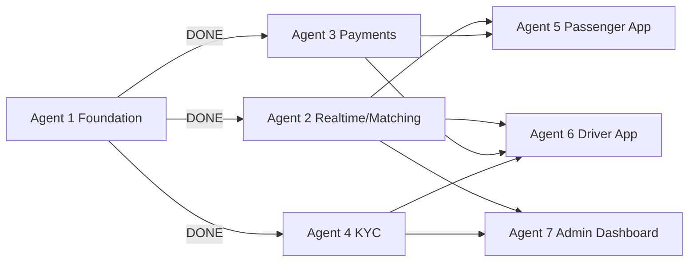
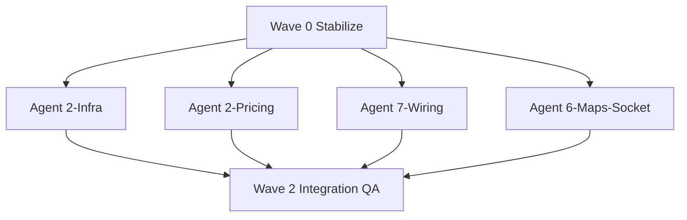

# HiGo Platform — Corrected Status Review & Parallel Agent Activation Plan

**Date:** 25 June 2026  
**Scope:** `higo-platform/` monorepo + `architecture/` contracts  
**Purpose:** Replace the informal gap-closure summary with a verified audit and an executable multi-agent roadmap.

---

## 1. Executive Summary

The original accounting is **directionally correct on backend blockers** but **understates frontend progress** and **overstates how "closed" production readiness is**. The six compile/deploy blockers are indeed fixed. What remains is less "missing features" and more **integration debt**: screens exist, APIs exist, but the glue (real sockets, real maps, real push, real settings persistence, separate worker process) is incomplete.

| Layer | Original Claim | Verified Reality | Completion |
|-------|----------------|------------------|------------|
| API compile + deploy scaffold | ✅ Closed | ✅ Confirmed (`Dockerfile`, `railway.toml`, modules wired) | **~85%** |
| Ride core (trips/matching/socket) | Implied done via blocker closure | ✅ Built; ⚠️ not production-hardened | **~75%** |
| Passenger app | "Frontend wiring" implied light | 41 screens exist; many still mock/API-partial | **~55% UI / ~30% wired** |
| Driver app | "6h onboarding + 6h maps" | 31 screens exist; Navigation is placeholder | **~60% UI / ~35% wired** |
| Admin dashboard | "4h settings API" | 18 pages built; Settings is local-only toast | **~65% UI / ~40% wired** |
| Production infra | "60% infrastructure" | Missing worker process, Redis socket adapter, observability | **~55% ops-ready** |
| E2E confidence | "16h empty specs" | 5 unit specs only; zero e2e project | **~5%** |

**Bottom line:** You are past "won't compile / won't deploy." You are at **"won't survive real traffic or a real ride without manual babysitting."** The fastest path to launch is not more greenfield screens — it is **parallel integration sprints** across Agents 2, 5, 6, and 7, led by a short Wave 0 stabilization pass.

---

## 2. Corrected Review of the Original Accounting

### 2.1 CLOSED — Confirmed ✅ (13 items)

All 13 closed items check out against the repo:

| # | Gap | Verification |
|---|-----|--------------|
| 1 | `DriversModule` / `AdminModule` in `app.module.ts` | Present in imports |
| 2 | `drivers.controller.ts` Prisma alignment | Uses `Driver`, `DriverLocation` models |
| 3 | `admin.controller.ts` Prisma alignment | Rewritten; uses real models |
| 4 | S3 → Alibaba OSS | `ali-oss` in dependencies |
| 5 | Textract → Alibaba Vision stub | Placeholder service exists |
| 6 | `POST /auth/admin/login` | Auth module extended |
| 7 | API `Dockerfile` | Multi-stage build present |
| 8 | Seed data | `prisma/seed.js` — zones, pricing, admin |
| 9 | Railway config | `railway.toml` + `Procfile` |
| 10 | Duplicate `drivers` route removed | TripsModule conflict resolved |
| 11 | `.env.railway` template | Present |
| 12 | `kyc.service.ts` → `OssService` | Import fixed |
| 13 | `.gitignore` env entries | Added |

**Nuance the original summary missed:** Closing compile blockers ≠ closing functional readiness. Example: `admin.controller.ts` still queries `user.type`, but the `User` Prisma model has **no `type` column** — dashboard passenger counts will fail at runtime.

---

### 2.2 NOT CLOSED — Reclassified with Better Accuracy

| # | Original Gap | Corrected Status | Real Blocker | Effort | Tier |
|---|--------------|------------------|--------------|--------|------|
| 1 | FCM push | Client mock only (`fcm.ts` generates fake tokens); **no server `PushService`** | Firebase credentials + `firebase-admin` | 6h | C (credentials) |
| 2 | Driver navigation map | Screen exists; `[ Map View Showing Route ]` placeholder | Google Maps SDK key + `react-native-maps` native build | 6h | C |
| 3 | Driver onboarding flow | Auth + KYC built; missing post-KYC vehicle/profile signup wizard | UI + `POST /drivers/register` wiring | 6h | B |
| 4 | Admin settings persistence | `GET /admin/settings` returns **hardcoded JSON**; no `PUT`; UI fakes save | `PlatformSettings` model + CRUD | 4h | A |
| 5 | Bull queue worker | `DispatchProcessor` + `BullModule` exist **in API process**; `Procfile` = single `web` dyno | Separate worker entrypoint + Railway service | 4h | A |
| 6 | Socket.IO Redis adapter | `EventsGateway` works single-instance; no `createAdapter` | `@socket.io/redis-adapter` + shared Redis | 2h | A |
| 7 | Observability | No Sentry/Datadog hooks | DSN + bootstrap instrumentation | 2h | C |
| 8 | E2E tests | Not "empty specs" — **no e2e project at all**; 5 unit specs in API | Detox/Playwright + seed fixtures | 16h | D |
| 9 | Schema missing models | `Vehicle` is **embedded in `Driver`** (by design); `Message` / `Conversation` truly absent for chat | ADR decision + migration | 8h | B |
| 10 | Surge pricing hardcoded | `SurgeRepository` implemented; `PricingService.estimateFare()` **ignores DB** and pins `surgeMultiplier = 1.0` | Wire repo + read `pricing_config` | 4h | A |
| 11 | Chat messaging | `ChatSupport.tsx` is UI shell; no backend | Message model + socket events | 8h | B |
| 12 | Referral/promo | Not started | Promo schema + booking hook | 10h | D |

**Tier key:**
- **A** — No external credentials; unblocks production scaling
- **B** — No credentials; unblocks product completeness
- **C** — Blocked on client-provided secrets
- **D** — Post-MVP / launch-hardening

---

### 2.3 What the Original Summary Got Wrong

1. **"Infrastructure 30% → 60%"** — Fair for deploy scaffold, but **misleading for runtime**. Without Bull worker + Redis socket adapter, horizontal scaling on Railway will break dispatch timeouts and websocket fan-out.

2. **"Highest-impact items: Bull, Redis adapter, admin settings"** — Correct priority, but incomplete. Add **surge/pricing DB wiring** and **admin.controller runtime bug fix** to Wave 1 — same tier, same credential-free constraint.

3. **"Driver onboarding not built"** — Overstated. KYC + auth exist. Gap is **post-approval vehicle/profile onboarding**, not zero onboarding.

4. **"Frontend wiring" framed as weeks away** — Understated. Passenger (41 screens), driver (31), admin (18) are largely scaffolded. The work is **replace mocks + connect stores to API/socket**, not build from Nx welcome page.

5. **"Schema missing Vehicle"** — Incorrect as stated. Vehicle fields live on `Driver`. Only chat/promo entities need new models.

6. **"6 critical blockers closed"** — True for compile/deploy. **7th hidden blocker:** no verified `nx build` + smoke test on Railway after deploy.

---

## 3. Current Architecture Position (Agent Map)



| Agent | Mandate | Status | Next Action |
|-------|---------|--------|-------------|
| **1** | Monorepo, auth, prisma, redis, OSS | ✅ Complete | Maintenance only |
| **2** | Trips, matching, socket, surge, zones | 🟡 ~75% | Worker + adapter + pricing wire-up |
| **3** | Paystack, escrow, earnings | ✅ ~90% | Trip lifecycle payment hooks QA |
| **4** | KYC upload, OCR stub, review | ✅ ~85% | Alibaba Vision provisioning |
| **5** | Passenger UX | 🟡 ~55% UI | API/socket/maps integration |
| **6** | Driver UX | 🟡 ~60% UI | Maps, socket, onboarding wizard |
| **7** | Admin ops | 🟡 ~65% UI | Remove mocks, wire CRUD |

---

## 4. Parallel Agent Activation Roadmap

### Design Principles

1. **Wave 0 is sequential** — one stabilizer agent fixes cross-cutting bugs before parallel work creates merge conflicts.
2. **Waves 1–2 maximize parallelism** — four agents with **disjoint file ownership** per wave.
3. **Credential-gated work (Wave 3) starts only after you drop secrets into `.env`** — agents stub with feature flags, not blockers.
4. **Each agent gets:** scope, files owned, interfaces consumed, definition of done, verify commands.

---

### Wave 0 — Stabilize (1 agent, ~4h, sequential)

**Agent:** `Orchestrator-0`  
**Branch:** `wave-0/stabilize`

| Task | Owner Files | DoD |
|------|-------------|-----|
| Fix `admin.controller` `user.type` bug | `admin.controller.ts` | `GET /admin/dashboard/stats` returns without Prisma error |
| Run full API build | — | `pnpm nx build @higo/api` passes |
| Run affected tests | — | `pnpm nx test @higo/api` passes |
| Railway smoke checklist | `README` or deploy notes | Health + OTP + trip request curl scripts documented |
| Publish interface freeze | `packages/shared-types` | No breaking changes during Wave 1 |

**Gate to Wave 1:** Build green + stats endpoint fixed.

---

### Wave 1 — Production Glue (4 agents in parallel, ~1 week)

No external credentials required. This is the **highest ROI** sprint.



#### Agent 2-Infra — Bull Worker + Redis Socket Adapter

**Owns:** `apps/api/src/main.ts`, `apps/api/src/realtime/*`, `apps/api/src/matching/*`, `Procfile`, `railway.toml`, new `apps/api/src/worker.ts`

**Tasks:**
1. Extract Bull consumer bootstrap to `worker.ts` (or `NestFactory.createApplicationContext` worker module).
2. Add `worker: node apps/api/dist/worker.js` to `Procfile`; document second Railway service.
3. Install `@socket.io/redis-adapter`; wire in `EventsGateway.afterInit`.
4. Add integration test: two API instances share socket room membership via Redis.

**DoD:**
- Dispatch timeout jobs process with API web dyno scaled to 0 workers (worker-only).
- Socket emit from instance A received by client on instance B.

---

#### Agent 2-Pricing — DB-Driven Fares + Surge Activation

**Owns:** `apps/api/src/pricing/*`

**Tasks:**
1. `estimateFare()` reads active `PricingConfig` row for `vehicleType` (not hardcoded kobo).
2. Call `SurgeRepository.getSurgeMultiplier(pickup)`; apply to subtotal.
3. Respect launch policy flag: `SURGE_ENABLED=false` default, env toggles.
4. Unit tests for night premium + surge + min fare cap.

**DoD:** Fare estimate changes when seed pricing row changes; surge zone returns multiplier > 1 when enabled.

---

#### Agent 7-Wiring — Admin Dashboard Live Data

**Owns:** `apps/admin-dashboard/src/pages/*`, `apps/admin-dashboard/src/services/api.ts`, `apps/api/src/admin/*`

**Tasks:**
1. Add `PlatformSettings` Prisma model + `GET/PUT /admin/settings`.
2. Wire `Settings.tsx` to API (remove fake toast-only save).
3. Remove mock fallbacks in `Login.tsx`, `DashboardOverview.tsx`, `DriverManagement.tsx`.
4. Wire `PricingConfig.tsx`, `ZonesGeofencing.tsx`, `Disputes.tsx` to existing admin endpoints.
5. Fix passenger count query (remove invalid `user.type` filter — use `User` count excluding drivers or dedicated query).

**DoD:** Admin can log in, see real KPIs, edit pricing row, save settings persisted in DB.

---

#### Agent 6-Maps-Socket — Driver Realtime + Navigation

**Owns:** `apps/driver-app/src/screens/online/*`, `apps/driver-app/src/services/*`, `apps/driver-app/src/stores/*`

**Tasks:**
1. Wire `tripStore` to socket events (accept/decline/location/status).
2. Replace `Navigation.tsx` mock with `react-native-maps` + route polyline from trip.
3. Background location upload to `POST /drivers/location` on online toggle.
4. Feature-flag map: `EXPO_PUBLIC_MAPS_MOCK=true` for web dev, native uses real maps.

**DoD:** Driver can go online, receive trip request via socket, see map route (native build), accept trip.

**Parallel-safe with Agent 5** because file ownership is disjoint (`driver-app` vs `passenger-app`).

---

### Wave 2 — Passenger + Chat Schema (3 agents in parallel, ~1 week)

#### Agent 5-Wiring — Passenger End-to-End

**Owns:** `apps/passenger-app/src/**`

**Tasks:**
1. Wire `tripStore` + `authStore` to `api-client` (request, cancel, rate, history).
2. Connect `services/socket.ts` to all trip lifecycle events.
3. Wire `Booking.tsx` → `ConfirmRide.tsx` → `FindingDriver.tsx` flow to real API.
4. Replace `MapView` web mock with native maps behind same feature flag pattern as driver.
5. Paystack sheet integration on trip confirm (test keys).

**DoD:** Passenger requests ride on staging → driver (Wave 1) accepts → both see status updates.

---

#### Agent 2-Chat — Messaging Backend

**Owns:** `apps/api/prisma/schema.prisma` (Message models), new `apps/api/src/messages/*`, `packages/shared-types`

**Tasks:**
1. ADR: add `Conversation` + `Message` models (trip-scoped).
2. REST: `GET/POST /trips/:id/messages`
3. Socket: `message:new` event in trip room.
4. Rate limit + auth guard.

**DoD:** Postman can send/receive trip messages; socket fans out to both parties.

---

#### Agent 5-Chat — Passenger + Driver Chat UI

**Owns:** `passenger-app/.../ChatSupport.tsx`, `driver-app/.../Support.tsx`

**Depends on:** Agent 2-Chat merged (or branch rebased) before socket wiring.

**DoD:** Active trip chat sends and receives messages in both apps.

---

### Wave 3 — Credential-Gated (3 agents, parallel once secrets provided)

| Agent | Needs From You | Delivers |
|-------|----------------|----------|
| **Agent-Push** | Firebase project JSON, FCM server key | `PushService` in API, real `registerFCM()` both apps |
| **Agent-Maps** | Google Maps API key (Android/iOS/JS restricted) | Directions API in backend, native map tiles |
| **Agent-Obs** | Sentry DSN | `@sentry/nestjs` + RN SDK, source maps |

**Activation trigger:** You add secrets to `.env.railway` and post `@agent-push go` (or equivalent orchestration command).

---

### Wave 4 — Launch Hardening (2 agents, post-Wave 2)

| Agent | Scope | Effort |
|-------|-------|--------|
| **Agent-QA** | Detox/Playwright e2e: login → book → complete → rate | 16h |
| **Agent-Growth** | Referral codes, promo schema, admin promo CRUD | 10h |

---

## 5. Agent Activation Commands (Copy-Paste Ready)

Use these as Task/subagent prompts. Run **Wave 0 first**, then launch Wave 1 agents **in parallel** (4 concurrent).

### Orchestrator-0 (Wave 0)
```
Read architecture/agent-instructions/*.md and apps/api/src/admin/admin.controller.ts.
Fix the invalid Prisma user.type queries. Run pnpm nx build @higo/api and pnpm nx test @higo/api.
Document Railway smoke test curls. Do not start feature work.
```

### Agent 2-Infra (Wave 1)
```
Implement Bull queue worker as separate process (worker.ts + Procfile + railway docs).
Add Socket.IO Redis adapter for multi-instance. Own only apps/api realtime/matching/main/worker/deploy files.
Verify dispatch timeout still fires when web dyno does not process jobs.
```

### Agent 2-Pricing (Wave 1)
```
Wire PricingService to PricingConfig DB and SurgeRepository. Add SURGE_ENABLED env flag defaulting false.
Add unit tests. Do not touch frontend or socket code.
```

### Agent 7-Wiring (Wave 1)
```
Add PlatformSettings model and GET/PUT /admin/settings. Wire admin-dashboard Settings and remove API mocks on Dashboard, Login, DriverManagement, Pricing, Zones, Disputes pages.
```

### Agent 6-Maps-Socket (Wave 1)
```
Wire driver-app socket + location services. Replace Navigation.tsx map mock with react-native-maps behind EXPO_PUBLIC_MAPS_MOCK flag. Do not edit passenger-app.
```

### Agent 5-Wiring (Wave 2)
```
Wire passenger-app booking and trip flows to api-client and socket.ts. Feature-flag maps consistent with driver-app. Do not edit apps/api except shared-types if required.
```

---

## 6. Dependency & Conflict Matrix

| Agent Pair | Can Parallelize? | Shared Risk | Mitigation |
|------------|------------------|-------------|------------|
| 2-Infra + 2-Pricing | ✅ Yes | Both touch `apps/api` | 2-Pricing stays in `pricing/`; 2-Infra avoids `pricing/` |
| 2-Infra + 7-Wiring | ✅ Yes | `admin.controller` | 7-Wiring owns admin controller; 2-Infra does not touch it |
| 6-Maps + 5-Wiring | ✅ Yes (Wave 1/2) | `shared-types` socket events | Freeze shared-types in Wave 0 |
| 2-Chat + 5-Chat | ⚠️ Sequential | Schema + types | 2-Chat merges first; 5-Chat rebases |
| Any + Orchestrator-0 | ❌ No | — | Wave 0 must finish first |

---

## 7. Recommended Execution Order (Your Decision Tree)

```
TODAY ──► Wave 0 (4h, 1 agent)
              │
              ▼
         Wave 1 (1 week, 4 parallel agents)  ◄── START HERE if you want max velocity
              │
              ├──► Staging deploy + manual ride test
              │
              ▼
         Wave 2 (1 week, 3 agents) — passenger E2E + chat
              │
              ▼
         Drop credentials ──► Wave 3 (parallel)
              │
              ▼
         Wave 4 — E2E automation + promo
```

**If you only have bandwidth for 3 agents today**, run:
1. **Agent 2-Infra** (production scaling)
2. **Agent 7-Wiring** (admin ops unblock)
3. **Agent 6-Maps-Socket** (driver can complete a ride)

Defer **Agent 2-Pricing** by 2 days only if launch policy keeps surge disabled — but still wire DB pricing before client fare sign-off.

---

## 8. Credentials Checklist (Unblock Wave 3)

| Secret | Used By | Status |
|--------|---------|--------|
| `FIREBASE_SERVICE_ACCOUNT_JSON` | Agent-Push | ❌ Needed |
| `GOOGLE_MAPS_API_KEY` | Agent-Maps | ❌ Needed |
| `GOOGLE_MAPS_ANDROID_SHA1_RESTRICTION` | Agent-Maps | ❌ Needed |
| `SENTRY_DSN` | Agent-Obs | ❌ Needed |
| `ALIBABA_CLOUD_VISION_*` | KYC OCR (optional) | ❌ Optional |
| `PAYSTACK_SECRET_KEY` (live) | Payments | ⚠️ Test mode works |

---

## 9. Success Metrics by Milestone

| Milestone | Evidence |
|-----------|----------|
| **M1: Staging API alive** | Railway health green, seed applied, admin login works |
| **M2: Single ride works** | Passenger books → driver accepts → trip completes → payment recorded |
| **M3: Multi-instance safe** | 2 Railway API replicas + 1 worker; socket + dispatch stable |
| **M4: Admin operable** | KYC approve, pricing edit, zone view, settings persist |
| **M5: Push + maps** | Real FCM received; native map shows route |
| **M6: Launch candidate** | E2E suite green on staging; Sentry capturing errors |

---

## 10. Honest Revised Assessment

| Question | Answer |
|----------|--------|
| Are compile/deploy blockers closed? | **Yes** |
| Can you launch tomorrow? | **No** — integration + worker + adapter gaps |
| Is infrastructure 60%? | **~55% ops-ready** (scaffold yes, runtime hardening no) |
| Is frontend "not built"? | **No** — UI is ~55–65%; wiring is the gap |
| Best next move? | **Wave 0 → Wave 1 (4 parallel agents)** |
| What do you need to provide? | Firebase + Google Maps + Sentry keys for Wave 3 |

---

## 11. Immediate Next Step

**Approve Wave 0**, then say which agents to activate:

- `"Run Wave 0"` — stabilizer pass
- `"Activate Wave 1 (all 4)"` — full parallel sprint
- `"Activate 2-Infra + 7-Wiring + 6-Maps only"` — reduced parallel set

Reference docs for agents:
- `architecture/agent-instructions/agent-2-realtime-matching.md`
- `architecture/agent-instructions/agent-5-passenger-app.md`
- `architecture/agent-instructions/agent-6-driver-app.md`
- `architecture/agent-instructions/agent-7-admin-dashboard.md`
- `higo-platform/GAP_CLOSURE_PLAN.md` (historical; superseded by this plan for execution)

---

*Generated from codebase inspection on 25 June 2026. Supersedes informal gap summaries for execution planning; does not replace ADR or API contract as source of truth.*